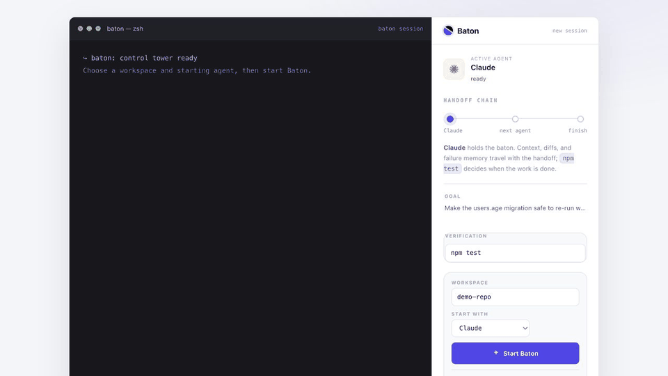

# Baton


[](https://github.com/Myst1C13/Baton/actions/workflows/ci.yml)
[](LICENSE)
[](package.json)
[](tsconfig.json)

> Built at the UC Berkeley AI Hackathon, 2026.

**Baton compiles noisy agent work into the smallest verified state another coding tool needs to continue.**

When an AI coding agent hits a usage limit, crashes, or stalls mid-task, you
normally have to re-explain everything to the next tool. Baton captures the
unfinished work from *factual evidence* (git diff, test exit codes, terminal
output), compiles a small portable **handoff packet**, launches a **different**
agent in the same repository, and verifies whether it actually finished — the
developer never re-explains the task.

Baton is not an editor or a Cursor clone. It transfers work *between* independent
tools (Claude Code ⇄ Codex CLI) through a visible, provider-neutral manifest.



*Claude Code hits a usage limit mid-fix → Baton compiles a verified handoff packet → Codex CLI resumes in the same repo → **Verify** runs the real tests and confirms the result.*

---

## Why Baton

Today, an AI coding agent is a single point of failure. The moment it stops —
usage limit, crash, network blip, or a provider-side outage — the context dies
with the session. The developer becomes the recovery mechanism: re-reading the
diff, reconstructing what the agent was attempting, and re-prompting a fresh tool
from scratch. That re-explanation tax is paid every time, and it grows with the
size of the change.

Baton removes the human from the recovery loop. It treats agent work as
**portable state**, not a disposable chat session. The state is rebuilt from
evidence the machine can verify — `git diff`, test exit codes, terminal output —
rather than from an agent's self-report, which may be wrong or optimistic. That
verified packet is small enough to hand to *any* compatible tool, so work
survives the death of the agent that started it.

## What works today

- Start Claude Code or Codex CLI against a local repository.
- Stream normalized process, terminal, file, and test events into the dashboard.
- Trigger a handoff manually or after a detected rate limit/context threshold.
- Rebuild state from Git, terminal evidence, and command exit codes.
- Distill that evidence into a small, runtime-validated handoff packet.
- Resume the other provider with the packet and repository already on disk.
- Run a user-selected verification command and decide pass/fail from its exit code.
- Persist event timelines and the latest packet in Redis when configured, with an
  in-memory implementation for local demos and tests.

The bundled demo uses deterministic fake agents so the complete flow is
repeatable without provider accounts. Real mode uses locally installed and
authenticated `claude` and `codex` CLIs.

## Trust boundary

Baton's server binds to `127.0.0.1`, keeps provider credentials in memory, and
does not require a hosted Baton service. Real agent runs still send prompts and
repository context to the provider selected by the user. The current Distiller
can include Git diffs and failure output in that provider request, so Baton
should not be described as keeping all code on-device.

Secret redaction, repository policies, signed audit logs, and self-hosted team
controls are roadmap work, not current guarantees.

## Current limitations

- Only Claude Code and Codex CLI have first-party adapters.
- Rate-limit and context-pressure detection exist; general provider-health and
  arbitrary-stall detection do not.
- Automatic handoffs are intentionally bounded to avoid provider ping-pong.
- Verification is one command and one exit-code verdict.
- Redis preserves events and packets, not the complete live process/session state.

---

## Quickstart

```bash
npm install
npm run demo
```

Open the printed dashboard URL (`http://127.0.0.1:4173/?api=…&ws=…`) and click
**Start Baton**. The demo runs deterministic fake agents end-to-end — no provider
CLI or auth required. Fake Claude reports a delayed usage limit, Baton
automatically hands the task to fake Codex, and **Verify** runs the real fixture
tests.

If those ports are already occupied, choose explicit alternatives:

```bash
PORT=4001 WEB_PORT=4174 npm run demo
```

Run the desktop app against the real subscription-authenticated CLIs:

```bash
claude                # complete Claude sign-in once, then exit
codex login           # complete Codex/ChatGPT sign-in once
npm run desktop:real  # leave API-key fields blank
```

### Docked sidebar (terminal companion)

Pin the rail beside your real terminal as a frameless desktop window:

```bash
npm run demo       # in one shell (server + UI)
npm run sidebar    # in another — opens the rail-only companion
```

Or open the rail-only view in any browser: `http://127.0.0.1:4173/?rail=1`.

### Desktop companion (Electron)

A native window that snaps to a screen edge — the "magnet" companion — and
adds a native folder picker for the workspace:

```bash
npm run desktop              # one-command safe demo; docks right
npm run desktop:real         # real locally authenticated CLIs
RELAY_DOCK=left  npm run desktop
RELAY_DOCK=float npm run desktop
RELAY_ONTOP=1    npm run desktop  # optional floating/always-on-top mode
```

The command starts the server, UI, and Electron shell together; closing Electron
stops the local stack. Inside the desktop app the Workspace field gains a
**Browse…** button (native OS folder dialog).

## The demo flow

1. An agent (Claude) starts fixing a real bug in `demo-repo/` — the `users.age`
   migration runs `ALTER TABLE` unconditionally, so the focused test fails.
2. The agent hits a usage limit with the test still red.
3. Baton freezes the workspace, distills a validated handoff packet, and launches
   the other agent (Codex) in the same repo from that packet alone.
4. Codex finishes the task; click **Verify** and Baton runs the real verification
   command, showing the exit code and verdict.

The user never re-explains the task during the transfer.

## Screens

| Ready | Handoff | Verified |
| --- | --- | --- |
|  |  |  |

## Architecture

```text
┌─────────────────────────────────────────────────────────────┐
│  React / Vite dashboard (ui/)                                │
│  live terminal + Baton rail   ◀── WebSocket events           │
└───────────────┬─────────────────────────────────────────────┘
                │ HTTP (/api) + WS (/ws/sessions/:id)
┌───────────────▼─────────────────────────────────────────────┐
│  Node + TypeScript server (apps/server/src/)                 │
│  ┌────────────┐ ┌───────────┐ ┌────────────┐ ┌────────────┐ │
│  │ session    │ │ process   │ │ orchestr.  │ │ broadcaster│ │
│  │ manager    │ │ runner    │ │ + handoff  │ │ (WS)       │ │
│  └────────────┘ └───────────┘ └─────┬──────┘ └────────────┘ │
│  ┌────────────┐ ┌───────────┐       │  ┌──────────────────┐ │
│  │ adapters   │ │ verifier  │       └─▶│ event store      │ │
│  │ claude/cdx │ │           │          │ Redis | in-memory│ │
│  └─────┬──────┘ └───────────┘          └──────────────────┘ │
└────────┼─────────────────────────────────────────────────────┘
         ▼
   Local Git repository (the workspace the agents operate in)
```

The browser requests actions; the server controls processes and secrets.
Evidence flows from the repo and command exit codes — **the repository and
executable evidence outrank agent summaries.**

### Distiller pipeline

```text
repository + runtime
        │
        ▼
Evidence Collector ──► EvidenceBundle (Zod)
        │                     │
        │                     ├─ goal + acceptance criteria
        │                     ├─ git branch/status/diff
        │                     ├─ changed files + commands
        │                     └─ latest failure + terminal excerpt
        ▼
Prompt Assembler ──► Claude or Codex compression backend
                              │
                              ▼
                    DistilledClaims (Zod)
                              │
EvidenceBundle + session metadata
                └─────────────┤
                              ▼
                    deterministic packet builder
                              │
                              ▼
                     HandoffPacket (Zod)
                              │
                 Redis/in-memory store ──► next agent
```

The model supplies only reasoning that cannot be recovered directly from disk:
the current summary, decisions, constraints, next actions, pitfalls, and focus
files. Baton fills changed files, command exit codes, provider identities, and
the verification command from deterministic evidence. If model distillation
fails or returns invalid JSON, Baton emits a deterministic fallback packet
instead of abandoning the transfer.

The local control server binds to loopback only (`127.0.0.1`) and accepts
browser/WebSocket traffic from the configured dashboard origin.

## Repository map

```text
packages/shared/    Runtime-validated contracts (RelayEvent, HandoffPacket, …)
apps/server/src/    HTTP, sessions, WebSockets, process runner, adapters, store
ui/src/             Terminal companion dashboard + live event projection
demo-repo/          Deterministic migration bug — the handoff target
tests/              Engine + cross-layer contract tests
```

Shared schemas are the dependency boundary: every layer may import
`packages/shared`, but contracts never import an application. Adapters emit
`RelayEvent`s through a `RelayEventSink`; they don't know whether events are
broadcast, persisted, or both.

## Verification

```bash
npm test          # engine + server suites
npm run typecheck
npm run ui:build
```

Redis is optional — set `REDIS_URL` for durable, refresh-surviving timelines;
without it, an in-memory store with the same interface is used.

## Built with

TypeScript · Node.js · React · Vite · Redis · WebSocket · Zod · Claude · Codex

## Roadmap

**Near term**

- Harden and benchmark authenticated `claude` + `codex` runs
- Restore resumable session state across Baton server restarts
- A reproducible benchmark with a measured no-Baton baseline for comparison
- Controlled multi-hop handoffs (A → B → C, each transfer verified)
- Signed desktop packaging and a user-configurable dock layout

**Provider resilience**

- Health-aware routing: detect rate limits / outages and fail over before a task
  stalls, not after.
- Pluggable adapters for more agents (additional CLIs and IDE agents) behind the
  same provider-neutral contract.
- Automatic retry-and-escalate: try a cheaper model, fall back to a stronger one
  only when verification fails.

**Team & enterprise**

- Shared handoff packets so a transfer can move *between developers*, not just
  between tools — pick up a teammate's in-flight agent work.
- Centralized, signed audit log of every handoff and verification verdict for
  compliance and review.
- Policy controls: allowed providers, data-residency boundaries, and per-repo
  verification commands enforced by the orchestrator.
- Self-hosted / VPC deployment with SSO, so the control plane stays inside the
  enterprise perimeter.

**Verification**

- Richer verdicts beyond a single exit code (per-test results, coverage deltas,
  lint/type gates) attached to each packet.

---

## Credits

Built at the UC Berkeley AI Hackathon, 2026, by:

- **Syed Mohammad Husain** ([@Myst1C13](https://github.com/Myst1C13))
- **Michael Lai** ([@Unieggy](https://github.com/Unieggy))
- **James** ([@jduhking](https://github.com/jduhking))

## License

[MIT](LICENSE) © 2026 Syed Mohammad Husain and Baton contributors.
